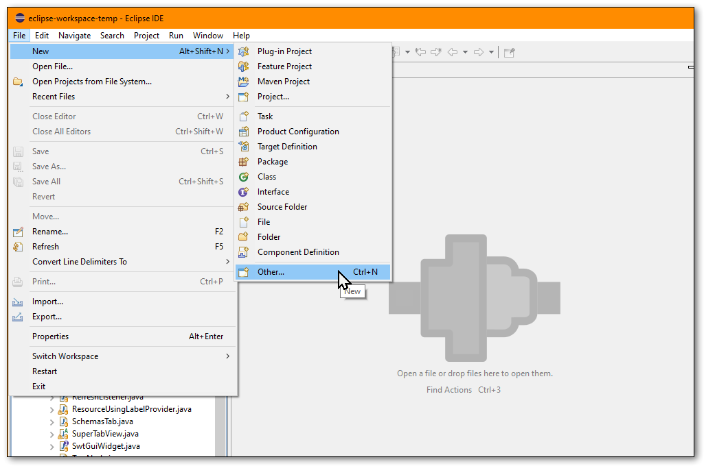
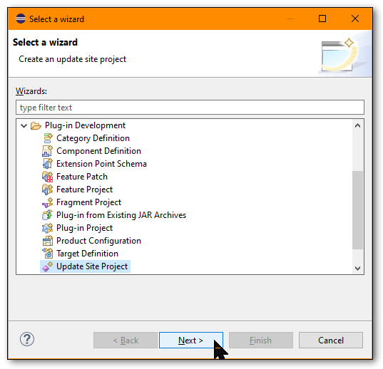
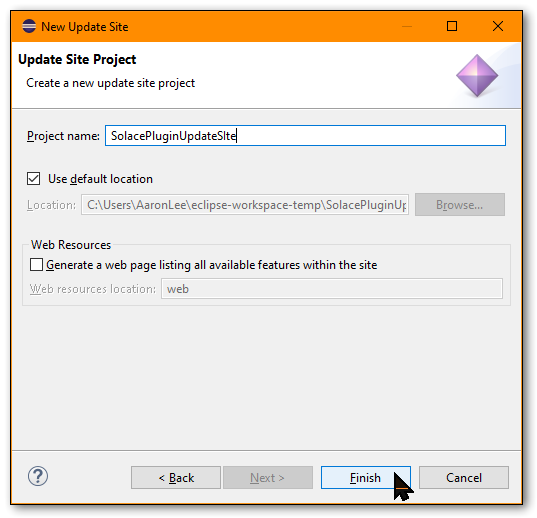
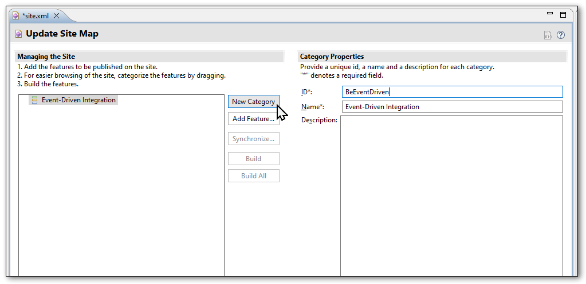
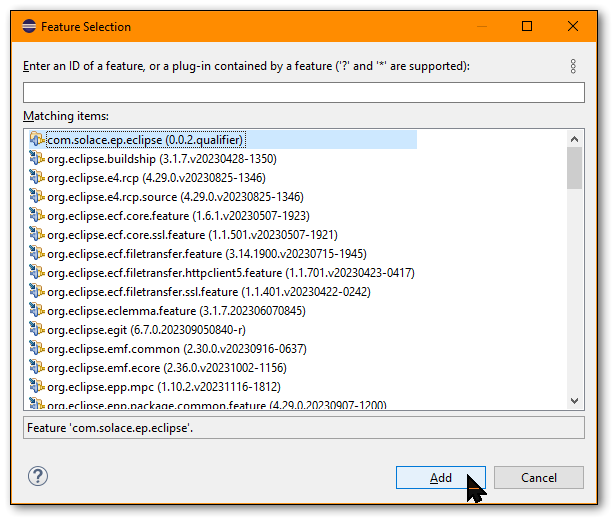

# solace-ep-eclipse-plugin

This project contains a PubSub+ Event Portal plugin for Mule AnyPoint Studio (legacy) or any other Eclipse-based RCP (e.g. Spring Tool Suite).
With the plugin installed, you can browse the data inside your PubSub+ Event Portal Designer, viewing Applications, Events, Schemas, EventAPIs and more.

When running inside Mule AnyPoint Studio, you are also able to generate a skeleton Mule Flow project, with all the appropriate components.  (more here)

Watch this video!  https://youtube.com/live/TJLPHxjNxCI

### Contents

- Installation
- Running
- Building

## Installation

The easiest way to install is to configure a new Update Site, pointing to the latest release hosted at `https://solace.dev/plugins`

### Help → Install New Software...

### Add... new site

### Site details `https://solace.dev/plugins`

### Select site, and install plugin

## Building

To build the plugin, you will need a copy of the Eclipse IDE, and the RCP (Rich Client Platform) plugins.  Search all available Update Sites for "RCP" and install the tools and developer resources found.

- First you'll need to download or clone this repo
- In Eclipse, switch to the "Plug-in development" Perspective
- From File → Import... → General → Existing Projects into Workspace
- Navigate to the "root" directory of this project (not the `view` or `feature` subdirectories)
- Import!

In order to construct a deployable "site" for updates, you will need to perform some additional steps.  This is required as it was noted during development that reusing a previous site caused some issues (the "Group By" category stopped working).

### File → New → Other...
Make sure the Perspective in Eclipsed IDE is set to "Plug-in development"

### Plug-in Development → Update Site Project → Next

### Choose any location you wish
This temporary Update Site plugin can be saved anywhere.  It is not necessary to generate the Web Resources.

### Add New Category 
Inside the `site.xml` file (which should have opened automatically), create a New Category:
- **ID:** `BeEventDriven`
- **Name:** `Event-Driven Integration`

### Add Feature...
Choose the Solace Event Portal Eclipse Feature plugin.  In Elicpse RCP speak, the Feature plugin is a "container" of one or more other related plugins (for example: a new View, an import wizard, a menu item plugin, etc.).  For the EP plugin, there is just one View plugin.

