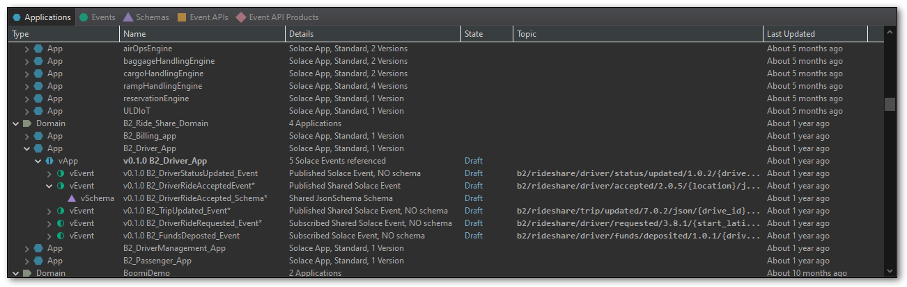

# Solace Event Portal plugin for Mule and Eclipse

This project contains the PubSub+ Event Portal plugin for Mule AnyPoint Studio or any other Eclipse-based IDE    (e.g. Spring Tool Suite).
With the plugin installed, you can browse the data inside your PubSub+ Event Portal Designer, viewing Applications, Events, Schemas, EventAPIs and more, and can even generate entire working skeleton proejcts!

**Watch this video!**  https://youtube.com/live/TJLPHxjNxCI&t=97

### Contents

- [Installation](#installation)
- [Running](#running)

## Installation

Configure a new Update Site, pointing to the latest release hosted at: `https://solace.dev/plugins`

### Help → Install New Software...

### Add... a new site

### Site details: `https://solace.dev/plugins`

### Select site, and install plugin

## Running

Once installed, you will need to configure a few user preferences.  Before you do, you will require an API token from the PubSub+ Event Portal.

### Log into the Event Portal
Log into the Event Portal.  Click on the "user" icon in the bottom-left corner, and select Token Management.

### Tick every "Read" option
Select every checkbox under the "Read" Column, all the way down the page.

### Create the token
Once you create the token, copy the long string either to the clipboard or to a file.

We are now ready to configure the plugin.

### Window → Preferences

### Click on 'Solace PubSub+'

### Copy your token from Event Portal

Give your token a name, based on your organization.  This is not an identifier, but a human-readable string for your benefit.
Copy the long token string into the obscured field.

If you access the web Event Portal SaaS using SSO, you may need to update the "URL for web portal"
with a different URL than the default `console.solace.cloud`.

Apply and Close.  You are now ready to use the Event Portal plugin.

### Load the Event Portal data

Click the green "play" button ▶ to load Event Portal data.  Depending on how much data is inside the 
organization, this may take some time.

Browse the various objects.  Double-click to fully expand a section of the tree.  Right-click on
any object to see what context-specific actions are available.  For example, versioned Applications
and versioned Event APIs can generate skeleton starter proejcts.

## Resources
This is not an officially supported Solace product.

For more information try these resources:
- Ask the [Solace Community](https://solace.community)
- The Solace Developer Portal website at: https://solace.dev

## Contributing
Contributions are encouraged! Please read [CONTRIBUTING.md](CONTRIBUTING.md) for details on our code of conduct, and the process for submitting pull requests to us.

## Authors
See the list of [contributors](https://github.com/SolaceLabs/solace-ep-eclipse-plugin/graphs/contributors) who participated in this project.

## License
See the [LICENSE](LICENSE) file for details.

