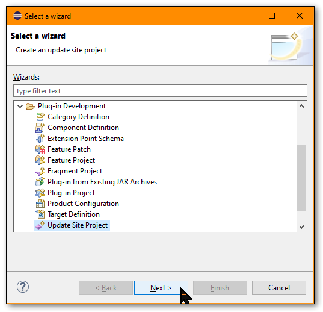
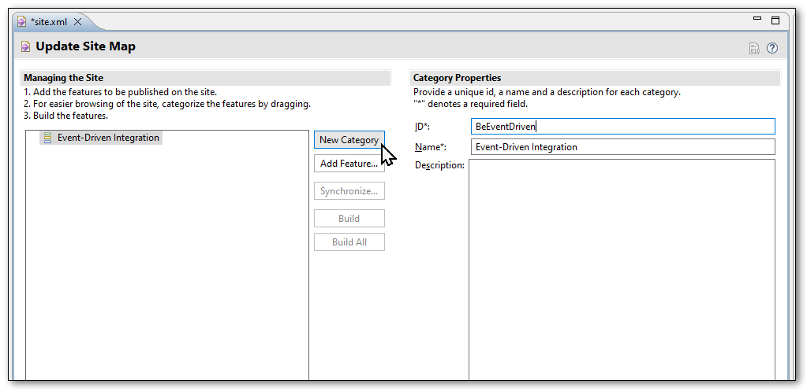

These instructions are just notes/guidelines on how to prepare this plugin to be hosted.  More for internal use.


## Building

To build the plugin, you will need a copy of the Eclipse IDE, and the RCP (Rich Client Platform) plugins.  Search all available Update Sites for "RCP" and install the tools and developer resources found.

- First you'll need to download or clone this repo
- In Eclipse, switch to the "Plug-in development" Perspective
- From File → Import... → General → Existing Projects into Workspace
- Navigate to the "root" directory of this project (not the `view` or `feature` subdirectories)
- Import!


In order to construct a deployable "site" for updates, you will need to perform some additional steps.  This is required as it was noted during development that reusing a previous site caused some issues (the "Group By" category stopped working).


### File → New → Other...
Make sure the Perspective in Eclipsed IDE is set to "Plug-in development"


### Plug-in Development → Update Site Project → Next




### Choose any location you wish
This temporary Update Site plugin can be saved anywhere.  It is not necessary to generate the Web Resources.


### Add New Category 
Inside the `site.xml` file (which should have opened automatically), create a New Category:
- **ID:** `BeEventDriven`
- **Name:** `Event-Driven Integration`




### Add Feature...
Choose the Solace Event Portal Eclipse Feature plugin.  In Elicpse RCP speak, the Feature plugin is a parent "container" of one or more other related plugins (for example: a new View, an import wizard, a menu item plugin, etc.).  For the EP plugin, there is just one View plugin.


### Build All


This will generate the Update site for the plugin which consists of a Feature plugin JAR (parent) and the View plugin JAR (the main/actual plugin), and related metadata files.  It should look something like this:

```bash
TempUpdateSite$ ls -lR

.:
total 12
-rwxrwxrwx 1 alee alee  609 Mar 11 05:40 artifacts.jar
-rwxrwxrwx 1 alee alee 5548 Mar 11 05:40 content.jar
drwxrwxrwx 1 alee alee 4096 Mar 11 05:47 features
drwxrwxrwx 1 alee alee 4096 Mar 11 05:47 plugins
-rwxrwxrwx 1 alee alee  309 Mar 11 05:40 site.xml

./features:
total 12
-rwxrwxrwx 1 alee alee 10483 Mar 11 05:47 com.solace.ep.eclipse_0.0.1.202403111940.jar

./plugins:
total 15312
-rwxrwxrwx 1 alee alee 15676982 Mar 11 05:47 com.solace.ep.eclipse.ui.EventPortal_0.0.1.202403111940.jar
```


### Verify the Category

If rebuilding multiple times, it was observed that at some point that eventually the "Event-Driven Integration" Category for the plugin
would just disappear.  As such, when installing the plugin in Eclipse / Mule, it was necessary to untick the "Group items by category" checkbox to see it.  (not great).

From the "root" directory of the temporary Update Site, run the `check-content.sh` script found within the `update-site` directory.  It will check the generated
Update Site to ensure the Category has been properly encode (it is checking the `content` JAR/XML to see if the text "EventDriven" can be found).  You should see some output that looks like:

```bash
$ /path/to/repo/update-site/check-content.sh
Should see something here if configured correctly.
    <unit id='BeEventDriven' version='1.0.0.0-3cKRqLh7737A3A5773CI'>
        <provided namespace='org.eclipse.equinox.p2.iu' name='BeEventDriven' version='1.0.0.0-3cKRqLh7737A3A5773CI'/>
```


### Sign the JARs

In order for Eclipse / Mule to not complain about the plugin being unsigned, it is required to sign the two JARs.  At the time of this writing (April 2024) we have not purchased an actual verified code signing certificate, and as such are using a self-signed certificate that Aaron has made.  But the steps are the same.

This assumes that the self-signed certificate has been stored in `keystore.jks` and has an alias of `server`.

From the temporary update site directory:

```bash
cd plugins
jarsigner -keystore /path/to/self/keystore.jks com.solace.ep.eclipse*.jar server
cd ../features
jarsigner -keystore /path/to/self/keystore.jks com.solace.ep.eclipse*.jar server
```

Then copy the whole site to wherever you want to host it.  For hosting on `solace.dev/plugins` you'll need to clone the `solace-dev` repo from SolaceDev GitHub.


